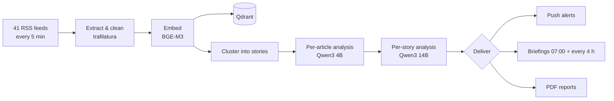
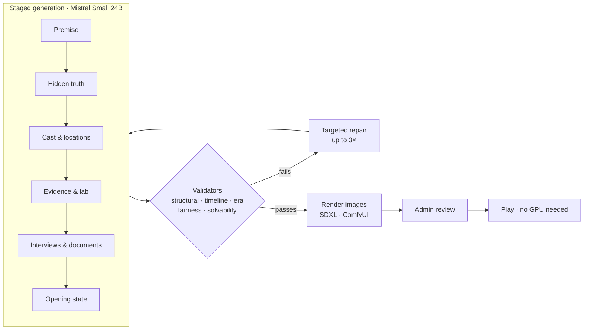
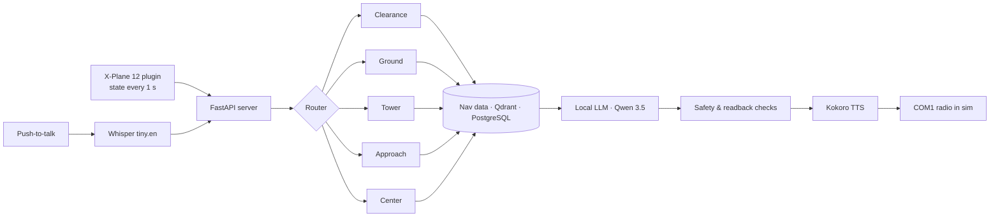
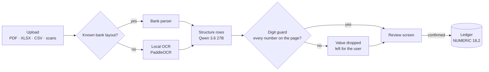
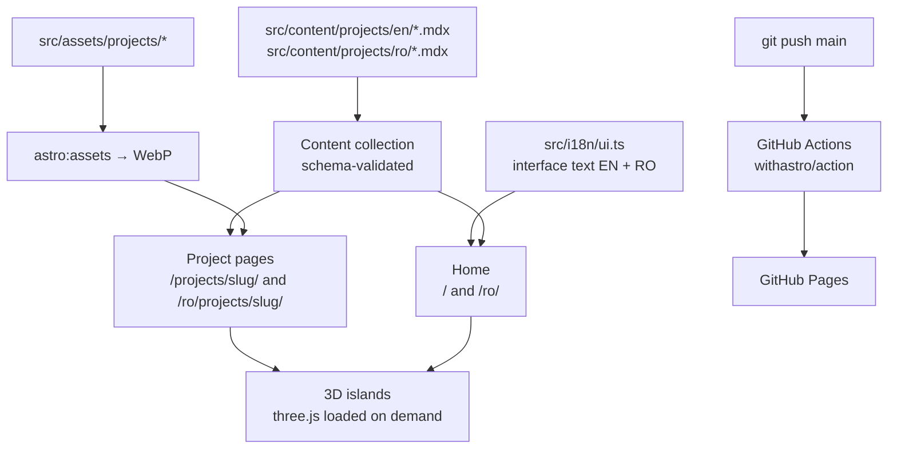

# North-Lab-RO

**Private AI systems, built and run on our own hardware.**

This repository is the source of the North-Lab-RO portfolio site: **https://north-lab-ro.github.io** (English) · **https://north-lab-ro.github.io/ro/** (Română)

| Project | Domain | What it does |
|---|---|---|
| [COUNSELOR](https://north-lab-ro.github.io/projects/counselor/) | News intelligence | Reads 41 outlets, groups coverage into stories and explains where the sources agree, with fact-checks computed from other outlets. |
| [CASES](https://north-lab-ro.github.io/projects/cases/) | Generative game | A local model writes a complete detective case, and validators prove it can be solved before anyone plays it. |
| [AI_ATC](https://north-lab-ro.github.io/projects/ai-atc/) | Voice AI · aviation | A self-hosted air traffic controller for X-Plane 12: speech in, ICAO phraseology out, entirely on-device. |
| [BANKY](https://north-lab-ro.github.io/projects/banky/) | Personal finance | Bank statements read by a local model; every number is checked against the page before it reaches the ledger. |

---

## How the projects work

### COUNSELOR



### CASES



### AI_ATC



### BANKY



---

## About this site



- **Astro** static site. Every page is plain HTML with no framework runtime.
- **Two languages.** English at `/`, Romanian at `/ro/`. First-time visitors whose browser prefers Romanian are sent to `/ro/`; the EN | RO switch remembers the choice. Interface text lives in `src/i18n/ui.ts`, project text in one file per language.
- **three.js** scenes load only when they scroll into view. They cap the pixel ratio on phones and pause when off-screen. With *reduced motion* on they keep moving, slowly and without parallax; on slow devices they lower resolution and frame rate instead of freezing. Add `?debug=1` to any URL to see what the 3D is doing on your device.
- **Tailwind CSS 4** for design tokens. Fonts are Unbounded, Hanken Grotesk and IBM Plex Mono.

### Develop locally

Requires **Node 22.12 or newer** (see `.nvmrc`).

```bash
npm install
npm run dev       # http://localhost:4321
npm run build     # static output in dist/
npm run preview   # serve the built site
```

### Add a project

Every project has one file per language, with the same file name:

1. Copy `src/content/projects/en/_template.mdx` to `src/content/projects/en/<slug>.mdx`, and `src/content/projects/ro/_template.mdx` to `src/content/projects/ro/<slug>.mdx`. The slug becomes `/projects/<slug>/` and `/ro/projects/<slug>/`.
2. Fill in the frontmatter in each language: title, category, tagline, metrics, features, stack, and optionally `gallery`, `reports` and `scene`.
3. Put images in `src/assets/projects/<slug>/`. They're converted to WebP at build time.
4. Set `draft: false` in both files and push. The home-page card and the project page are generated automatically.

`order` controls the position in the Projects list (the first one is featured). `accent` picks the project colour (`ice`, `aurora`, `ember`, `violet`). `scene` picks a 3D hero (`globe`, `board`, `radar`, `ledger`), or use `none` to show the cover image instead.

To show a "next project" placeholder card on the home page, set `showComingSoon = true` in `src/config.ts`.

### The sales part of a project page

Every project page opens with a client-facing section, driven by these frontmatter fields (write them in both language files):

| Field | What it is |
|---|---|
| `promise` | The headline benefit, one short sentence. |
| `tagline` | One or two sentences on what the product does for the client. |
| `audienceShort` | Short "For:" labels shown in the hero and on the home card. |
| `outcomes` | Three `{title, body}` cards: what changes for the client. |
| `audiences` | `{title, body}` cards: who it is for, with a concrete use each. |
| `tour` | Which product tour to show (`counselor`, `cases`, `atc`, `banky`, or `none`). Tours live in `src/components/tours/`. |
| `capabilities` | Groups of `{group, items[]}`: the full feature checklist. |
| `requirements` | What the client needs, in plain terms. |
| `tailoring` | What can be customised for the client. |
| `note` | Optional small print under the delivery section. |

Everything technical (the MDX body, metrics, pipeline, code) appears below a **"For your technical team"** divider.

### Real screenshots

Drop PNG, JPG or WebP files into `src/assets/projects/<slug>/screens/`. They appear under **"The real app"** on that project's page in both languages, in file-name order (so name them `01-…`, `02-…`). The section stays hidden while the folder is empty. Check screenshots for personal data before committing.

### Contact and "Request a demo"

Set `email` and/or `linkedin` in `src/config.ts`. The **Request a demo** buttons (hero, project pages, closing band) and the footer contact block appear only once at least one is set. The email opens pre-filled with the product name in the subject.

### Add a PDF report

Drop the file into `public/reports/`, then point a `reports` entry at it (in both language files):

```yaml
reports:
  - title: Daily briefing (PDF)
    description: A full generated briefing.
    file: counselor-daily-briefing.pdf
```

An entry without `file` shows a "Sample in preparation" slot.

### Deploy

Every push to `main` builds and deploys through `.github/workflows/deploy.yml`.
One-time setup: **Settings → Pages → Build and deployment → Source: GitHub Actions**.

---

Source code for the showcased projects is private and available on request.
