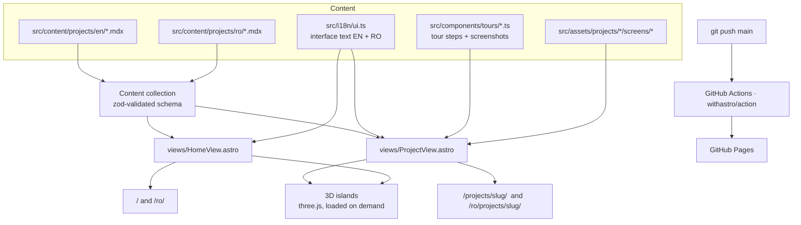
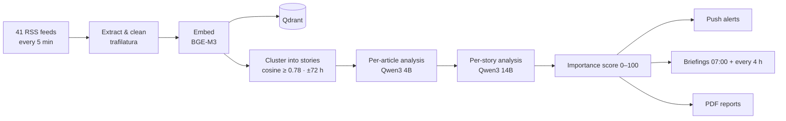
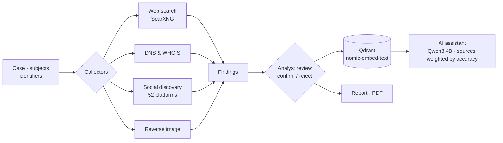
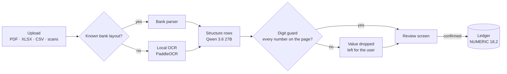
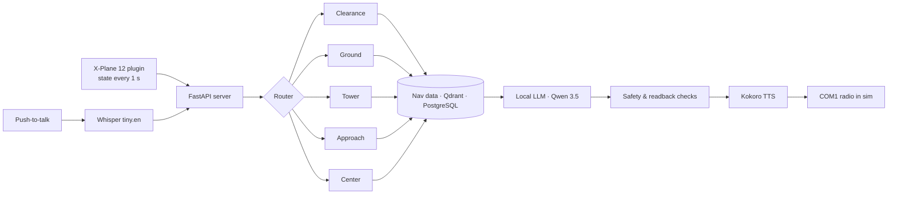
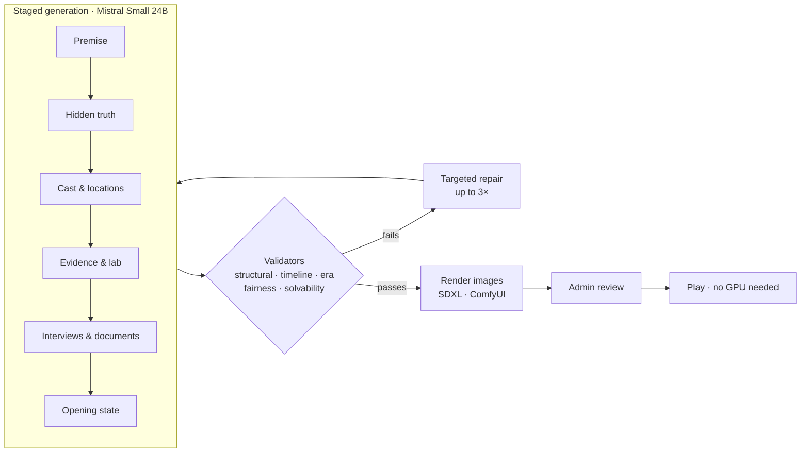

# North-Lab-RO

**Private AI systems, installed on your own hardware.**

Source of the North-Lab-RO website: **https://north-lab-ro.github.io** (English) · **https://north-lab-ro.github.io/ro/** (Română)

| Product | Domain | What it does |
|---|---|---|
| [COUNSELOR](https://north-lab-ro.github.io/projects/counselor/) | News intelligence | Reads 41 outlets, groups coverage into stories and writes a balanced briefing, with alerts only for what matters. |
| [ATHENA](https://north-lab-ro.github.io/projects/athena/) | Investigations · OSINT | One workspace for team investigations: automated collection, analyst-reviewed findings, a private AI assistant and PDF reports. |
| [BANKY](https://north-lab-ro.github.io/projects/banky/) | Personal finance | Reads bank statements and receipts locally; every number is checked against the page before it reaches the ledger. |
| [AI_ATC](https://north-lab-ro.github.io/projects/ai-atc/) | Voice AI · aviation | A spoken air traffic controller for X-Plane 12, from clearance to landing, entirely on-device. |
| [CASES](https://north-lab-ro.github.io/projects/cases/) | Generative game | Writes complete, provably solvable detective cases for teams to crack around one screen and a printed kit. |

Source code of the products is private and available on request.

---

## Contents

1. [Architecture](#architecture)
2. [Directory structure](#directory-structure)
3. [Content model](#content-model)
4. [Two languages](#two-languages)
5. [3D engine](#3d-engine)
6. [Product tours and real screenshots](#product-tours-and-real-screenshots)
7. [Sample reports](#sample-reports)
8. [Accessibility and performance](#accessibility-and-performance)
9. [Develop, check, deploy](#develop-check-deploy)
10. [How the products work](#how-the-products-work)

---

## Architecture

A static [Astro](https://astro.build) site. Every page is plain HTML; JavaScript ships only for interactive islands (3D scenes, tours, galleries, the menu).



- **Astro 7**, **Tailwind CSS 4** (design tokens in `src/styles/global.css`), **MDX** for product pages, **three.js** for 3D, **Lenis** for smooth scrolling.
- Self-hosted fonts (Unbounded, Hanken Grotesk, IBM Plex Mono via Fontsource), so no third-party font requests.
- `astro:assets` converts every image to responsive WebP at build time.

## Directory structure

```
src/
├─ config.ts                 site name, GitHub, contact (email / LinkedIn)
├─ content.config.ts         project schema (zod)
├─ lib.ts                    getProjects(lang), accent colours
├─ i18n/ui.ts                every interface string, EN + RO; altPath(), projectHref()
├─ layouts/Base.astro        <head>, SEO, hreflang, smooth scroll, reveals
├─ views/                    HomeView, ProjectView (shared by both languages)
├─ pages/                    index, projects/[slug], ro/index, ro/projects/[slug], 404
├─ content/projects/{en,ro}/ one MDX file per product and language, plus _template.mdx
├─ components/
│  ├─ sections/              Hero, Services, ProjectsGrid, FeaturedProject, About, Process, TechWall, Contact
│  ├─ sales/                 SalesBlock, DemoButton, CtaBand
│  ├─ tours/                 TourFrame.astro + one data file per product
│  ├─ project/               Gallery, ReportSlot, InfoGrid, ScoreBars, CounselorStory, ProjectVisual
│  ├─ samples/               illustrative sample outputs (story analysis, case file, radio, import review)
│  ├─ diagrams/              Pipeline (linear stages) and Flow (workflows with decisions)
│  └─ 3d/                    engine.ts + scenes
└─ assets/projects/<slug>/   images, logos, screens/
public/reports/              sample PDFs and their first-page previews
```

## Content model

Each product is one MDX file per language with the same file name. The frontmatter is validated by `src/content.config.ts`:

| Field | Purpose |
|---|---|
| `title`, `category`, `tagline`, `summary` | Name, domain label, one-line client value, technical summary |
| `order`, `draft` | Position in the Products list (the first is featured on the home page); hide while drafting |
| `accent` | `ice`, `aurora`, `ember`, `violet` or `indigo` |
| `scene` | 3D hero: `globe`, `board`, `radar`, `ledger`, `graph` or `none` (cover image) |
| `promise`, `audienceShort` | Hero headline and the "For:" labels |
| `outcomes`, `audiences` | Client outcomes and who it is for |
| `tour` | Product tour to show (`counselor`, `athena`, `banky`, `atc`, `cases`) |
| `capabilities` | Full feature checklist, grouped |
| `requirements`, `tailoring`, `note` | What the client needs, what can be customised, small print |
| `roadmap` | Planned features, shown as "Coming soon" with an "In development" tag; never presented as available |
| `metrics`, `stack`, `credits` | Technical facts shown below the "For your technical team" divider |
| `gallery`, `reports` | Extra images; report slots (`file` in `public/reports/`, or empty for a placeholder) |

Everything a client reads comes first; the MDX body (architecture, pipeline, workflow diagrams, measurements) follows under **"For your technical team"**.

**Add a product:** copy `src/content/projects/en/_template.mdx` and `ro/_template.mdx` to `<slug>.mdx`, fill both, add images under `src/assets/projects/<slug>/`, set `draft: false`, push.

## Two languages

- English lives at `/`, Romanian at `/ro/`. Pages are generated from the same views with a `lang` prop; interface text comes from `src/i18n/ui.ts`, product text from the language's MDX file.
- **English by default:** `/` is always English and nothing redirects by browser language; visitors switch with the EN | RO control in the header, which keeps the current section (`#hash`) when changing language.
- `hreflang` alternates and `x-default` in every page head; the sitemap carries the same links.
- **No mixed languages:** a build-time check extracts the visible text and ARIA labels of every page and flags the other language. Allowed exceptions are ICAO radio phraseology and real-product screenshots, which are captioned with the product's interface language.

## 3D engine

`src/components/3d/engine.ts` mounts every scene and enforces the same rules:

- **Loaded on demand.** Scenes load after the page is idle and only when scrolled near; three.js is split into its own chunk and never ships in the initial HTML. A WebGL pre-check skips the download entirely on devices without WebGL.
- **Pixel-ratio cap** (1.5 on phones, 2 elsewhere) and **pause when off-screen** or when the tab is hidden.
- **Frame governor.** Slow devices first step down the pixel ratio (2 → 1.5 → 1 → 0.75), then cap at 30 fps. The animation never freezes.
- **Calm mode.** With *reduce motion* on, scenes keep moving at ~35% speed with no pointer parallax, and smooth scrolling is off.
- **`?debug=1`** on any URL shows the GPU, whether rendering is in software, fps, pixel ratio and calm mode.

| Scene | Where | What it shows |
|---|---|---|
| `NorthStar` | Home hero | A faceted star in a compass ring, aurora and star field |
| `Globe` | COUNSELOR | News sources arcing into one story |
| `CounselorStory` | COUNSELOR "How it works" | Scroll-driven, four stages (sources, clusters, analysis, delivery); GPU morph of up to 1,000 particles |
| `Graph` | ATHENA | Subject → identifiers → findings being confirmed or rejected |
| `Ledger` | BANKY | A statement scanned; each number passes a guard gate, one is rejected |
| `Radar` | AI_ATC | Radar sweep with aircraft on approach paths |
| `Board` | CASES | An evidence board with pinned photos and red string |

### Diagrams, not code

The site shows no source code. The logic behind each product is drawn with `Flow` (`components/diagrams/Flow.astro`): steps down a spine, decisions as diamonds whose side-exits are tinted by outcome (green accepted, red dropped, amber flagged) and always labelled in words. On desktop the exits sit beside their decision; on phones, below it. `Pipeline` draws the linear "How it works" stages.

## Product tours and real screenshots

- `components/tours/TourFrame.astro` renders a tabbed tour: a real screenshot per step, numbered markers placed as percentages of the image, the explanation beside it, ‹ › arrows, keyboard navigation and auto-advance that pauses on hover or focus.
- Screenshots of any shape (wide desktop, tall panel, phone) are fitted whole inside the 16:10 stage: each screen is a size container and the image box is `min(100cqw, 100cqh × ratio)`, so markers always stay on the image.
- Each product's tour is a data file (`components/tours/<slug>.ts`) returning the steps for a language; screenshots are shared between languages.
- **The screenshots are of the real applications with invented data.** Each app's own frontend was run locally from a copy, and every API request was answered in the browser with invented data shaped exactly like the app's TypeScript types. No real person, company, account or news item appears; no production system or database was touched.
- Extra screenshots dropped into `src/assets/projects/<slug>/screens/` appear under **"The real app"** automatically.

## Sample reports

- **COUNSELOR morning briefing** — produced by the application's own PDF renderer (Jinja2 + WeasyPrint) from an invented briefing, run in a throwaway container with no database.
- **BANKY monthly report** — the application's own Reports page with invented data, printed through the browser's print pipeline, exactly as the app's Print button does.
- **ATHENA intelligence report** — the application's own structured-report renderer (WeasyPrint) on an invented due-diligence case.
- **CASES printable kit** — the game's own "Print the kit" pages (cover, briefing, map, locations, exhibits, lab reports) for an invented case, printed through the browser's print pipeline and compressed for the web.
- Report slots show a first-page preview and an "Open PDF" link; a slot without a file shows "Sample in preparation".

## Accessibility and performance

- Lighthouse (mobile): **Accessibility 100 · Best Practices 100 · SEO 100** on every page. Performance depends on the 3D scenes and the device's GPU; with WebGL off it scores 99.
- Every screenshot has alternative text, every 3D canvas has a text label, and each tour step is explained in text beside the image.
- No horizontal scroll at 320, 375 and 414 px; tours and galleries have arrow buttons on touch screens.
- `prefers-reduced-motion` is respected everywhere (calm 3D, opacity-only reveals, no smooth scroll).

## Develop, check, deploy

Requires **Node 22.12 or newer** (see `.nvmrc`).

```bash
npm install
npm run dev       # http://localhost:4321
npm run check     # type-check (astro check)
npm run build     # static output in dist/
npm run preview   # serve the build
```

**Contact and demo buttons:** set `email` and/or `linkedin` in `src/config.ts`. The "Request a demo" buttons and the contact block appear only once one is set; the email is pre-filled with the product name.

**Deploy:** every push to `main` builds and publishes through `.github/workflows/deploy.yml` (Settings → Pages → Source: GitHub Actions).

---

## How the products work

### COUNSELOR



### ATHENA



### BANKY



### AI_ATC



### CASES


